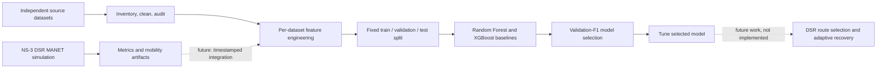
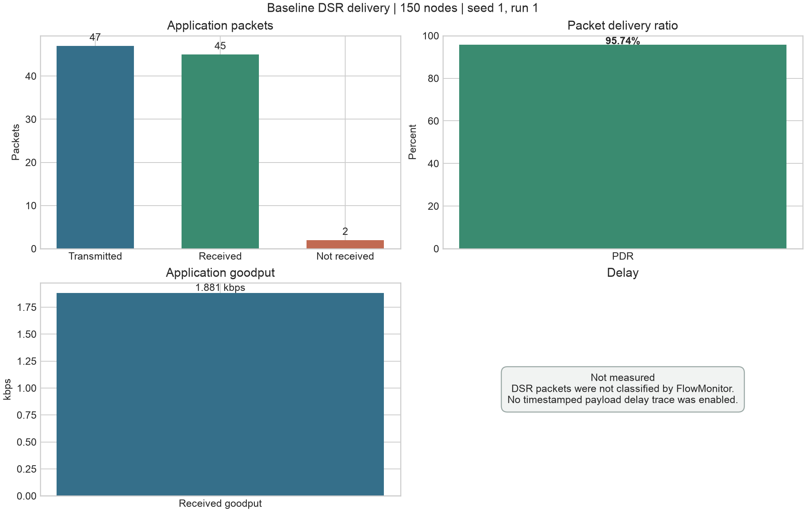
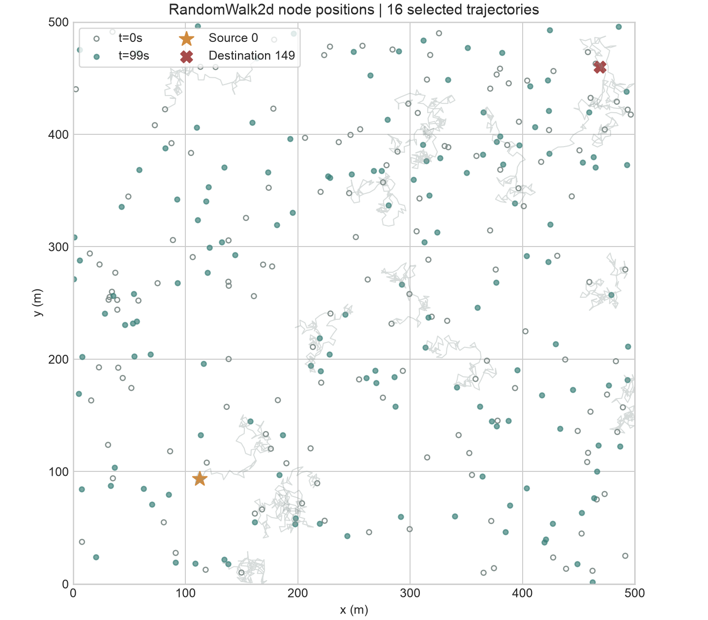
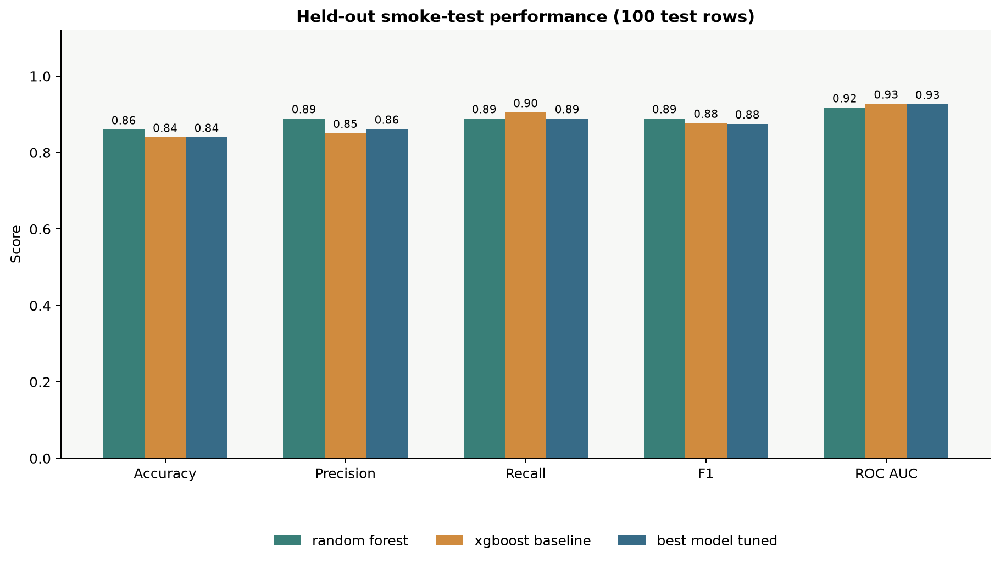
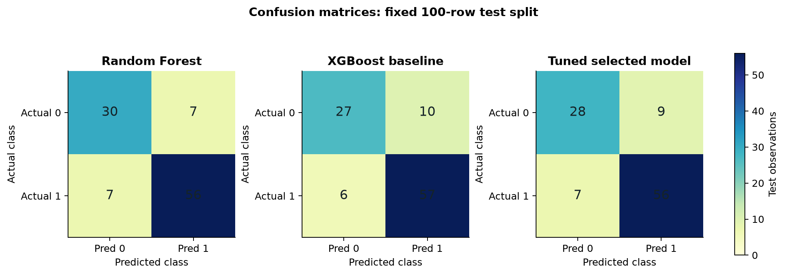
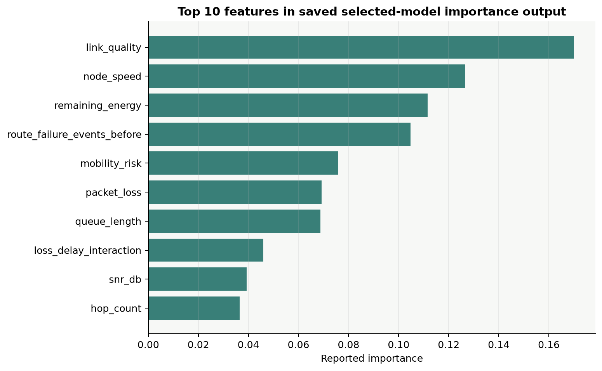
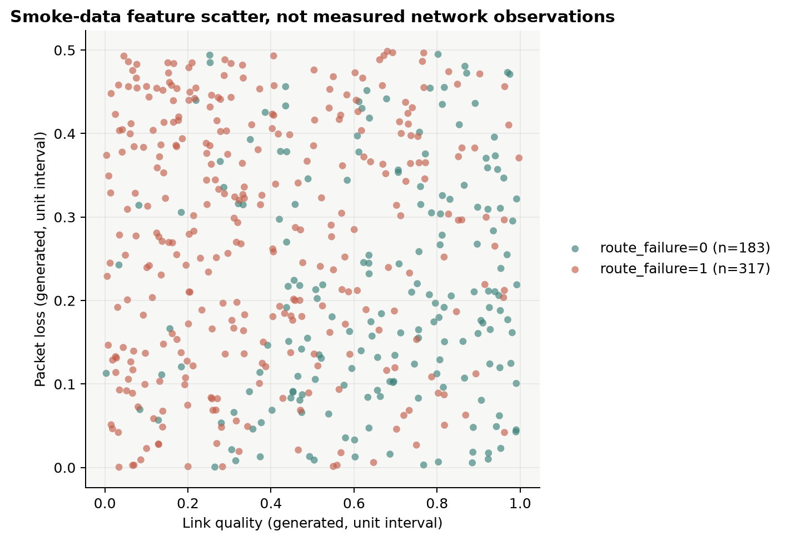

# DSR-ML-MANET Project and Experiment Summary

## At a Glance

This dissertation project investigates a future multi-factor route-failure prediction and adaptive-recovery framework for DSR-based mobile ad hoc networks (MANETs). Its workflow covers NS-3 simulation, dataset inventory and cleaning, feature engineering, and Random Forest/XGBoost comparison. **The current ML evaluation validates the pipeline on deterministic synthetic smoke data; neither trained model is integrated into DSR route selection or recovery.**

## Project Workflow
  

VS Code is used for persistent source and analysis; the documented reproducible environment is Google Colab with NS-3. The local run reported below used the available NS-3.48/macOS build. The project guide describes NS-3.47 for Colab, so simulator versions must be stated with each experiment and results should not be assumed bit-for-bit comparable across versions.

## Baseline DSR Simulation

A measured baseline was run with 150 Wi-Fi 802.11b ad-hoc nodes in a 500 m by 500 m area, RandomWalk2d mobility at 5 m/s, a 250 m range-propagation limit, and a single 2 kbps UDP flow using 512-byte payloads. Simulation time was 100 seconds; seed/run was 1/1; source/destination were node 0 and node 149.

| Measurement | Saved run result |
|---|---:|
| Application packets sent | 47 |
| Application packets received | 45 |
| Packets not received | 2 |
| Packet delivery ratio | 95.74% |
| Payload bytes sent / received | 24,064 / 23,040 |
| Received goodput | 1,880.82 bit/s |
| End-to-end delay | Not measured |
| DSR route path | Not available from the route-trace interface used |

The metrics use application Tx/Rx traces. FlowMonitor produced no classifiable IPv4 flow entries for this DSR-encapsulated traffic, so delay is left blank rather than inferred. The NetAnim file visualizes mobility; it has no packet markers and must not be interpreted as a route visualization.

## Data and ML Smoke Experiment

The repository includes independent mobility, dynamic-node, packet-loss, and MANET/link-failure datasets, plus cleaned, audited, and feature-engineered outputs. Dataset inventory notes that sources are kept separate rather than silently merged; their targets and feature units are not all equivalent. The larger prepared datasets are not the data used for the saved model comparison here.

The saved ML experiment used `data/final/smoke_test/features.csv`: 500 deterministic synthetic rows generated with seed 7. Its binary target is `route_failure`, with 183 class-0 and 317 class-1 rows. The fixed split contains 300 training rows, 100 validation rows, and 100 held-out test rows. Validation F1 selected the XGBoost baseline (0.8806) over Random Forest (0.8615); the selected model was then tuned. All reported test metrics below are on the same 100-row smoke-test holdout.

| Model | Accuracy | Precision | Recall | F1 | ROC AUC | Inference time (s) |
|---|---:|---:|---:|---:|---:|---:|
| Random Forest | 0.86 | 0.889 | 0.889 | 0.889 | 0.9174 | 0.02670 |
| XGBoost baseline | 0.84 | 0.851 | 0.905 | 0.877 | 0.9275 | 0.00075 |
| Tuned selected model | 0.84 | 0.862 | 0.889 | 0.875 | 0.9266 | 0.00161 |

Random Forest has the highest saved test accuracy and F1; XGBoost baseline has the highest ROC AUC and validation F1. The experiment's selection procedure chose XGBoost using validation F1, not test-set performance. These small differences are smoke-pipeline observations, not evidence of generalization to real network traces.

The following scatter plot shows two **generated synthetic input features**, not measurements from the NS-3 baseline or the independent source datasets.

## Interpretation and Limits

- The ML smoke target was generated from a deterministic formula involving selected synthetic feature values plus noise. Its scores validate code paths, data splitting, evaluation, and artifact generation only.
- The real DSR run and the smoke ML dataset have not been joined. In particular, the DSR run did not measure delay or expose route paths, and it cannot substantiate the smoke model's predictive performance.
- Model feature importance and confusion matrices describe this synthetic holdout only; they do not establish causal importance or operational benefit.
- The planned next research step is to produce timestamped, multi-run DSR observations with pre-failure features and explicit failure-window labels, validate feature units/target definitions across data sources, then evaluate on run- or scenario-separated real traces.
- Random Forest/XGBoost route scoring, ML-driven DSR route choice, and adaptive recovery remain future work.

## Artifacts

- [Baseline DSR report](../ns3/results/reports/dsr_baseline_report_seed_1_run_1.md)
- [Baseline metrics CSV](../ns3/results/csv/dsr_metrics_seed_1_run_1.csv)
- [Baseline mobility CSV](../ns3/results/csv/dsr_mobility_seed_1_run_1.csv)
- [Baseline route-availability CSV](../ns3/results/csv/dsr_route_events_seed_1_run_1.csv)
- [NS-3.48 NetAnim mobility XML](../ns3/results/animation/dsr_manet_seed_1_run_1.xml)
- [Model comparison CSV](model_comparison.csv)
- [Smoke-pipeline summary JSON](pipeline_summary.json)
- [Random Forest confusion matrix](random_forest_confusion_matrix.csv)
- [XGBoost baseline confusion matrix](xgboost_baseline_confusion_matrix.csv)
- [Tuned-model confusion matrix](best_model_tuned_confusion_matrix.csv)
- [Random Forest classification report](random_forest_classification_report.json)
- [XGBoost classification report](xgboost_baseline_classification_report.json)
- [Tuned-model classification report](best_model_tuned_classification_report.json)
- [Summary-figure generator](../ml/generate_project_summary_figures.py)
